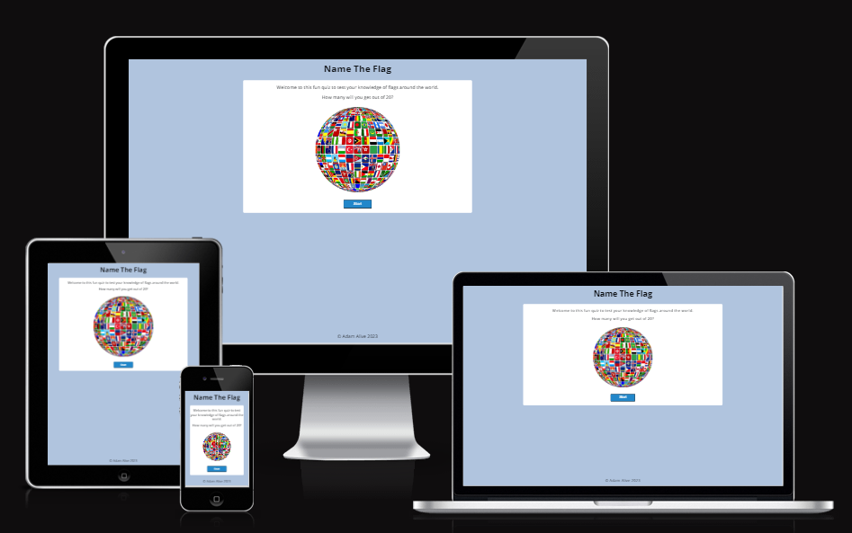
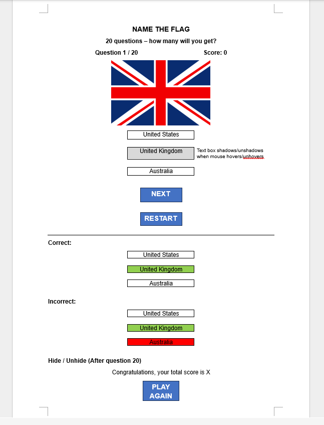
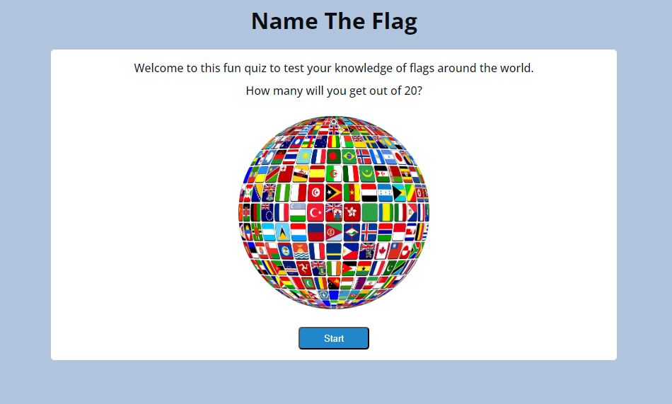
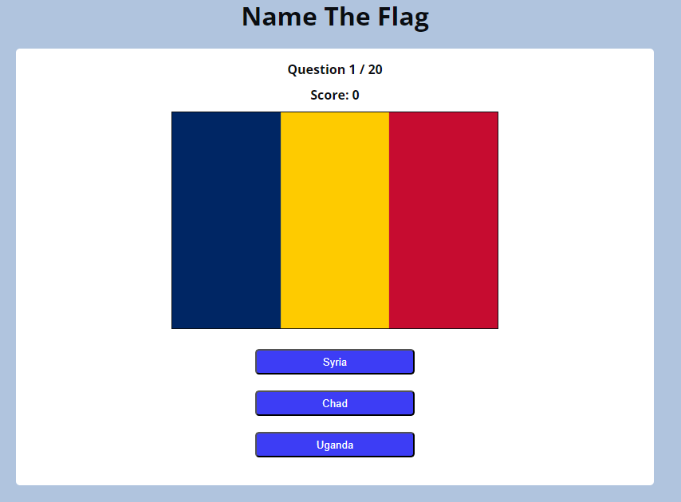
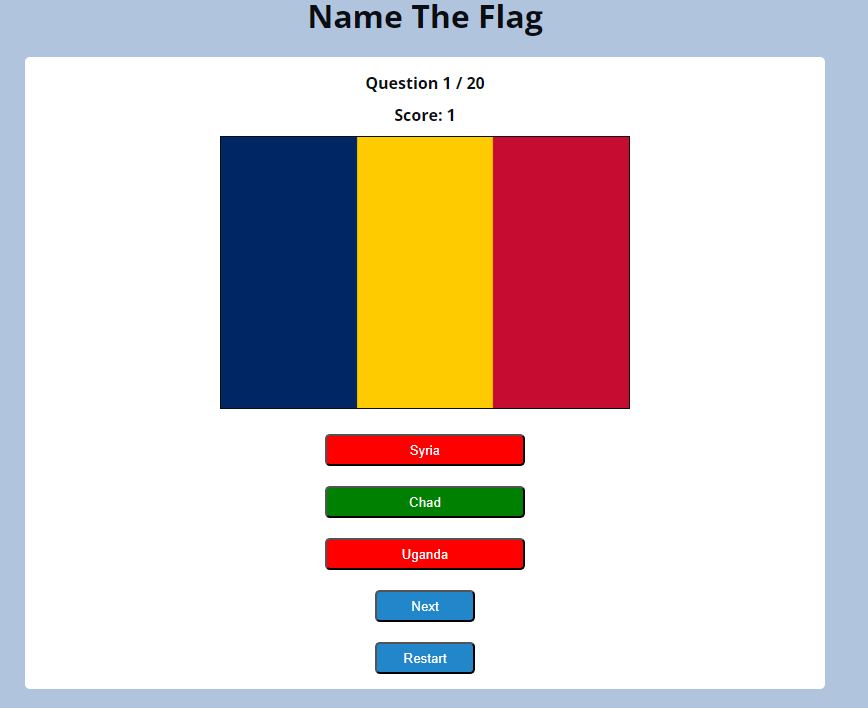
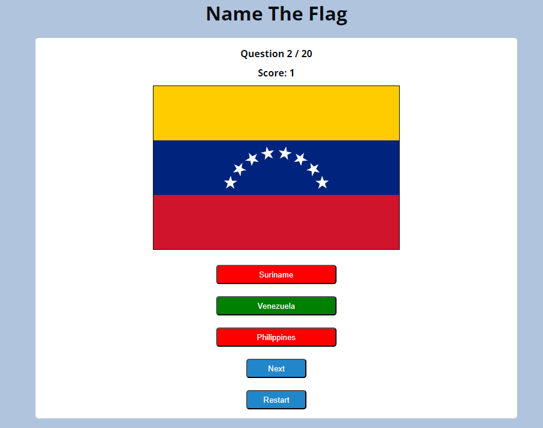
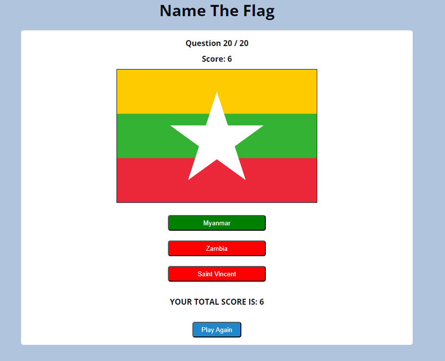
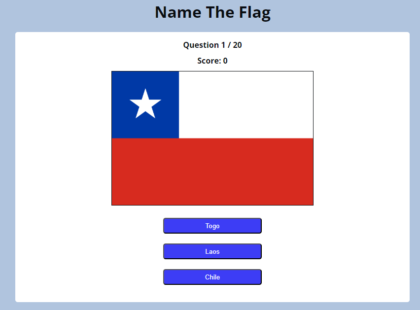

# [NAME THE FLAG GAME](https://adam-alive.github.io/name-the-flag-game)

## Project Purpose

The purpose of this project is to create a simple and intuitive quiz-game where users can test their knowledge of world flags.

Users will be able to navigate the game with minimal instructions, enjoying a clean and uncluttered design.

For each question, a flag image will appear on screen and users can choose a country from one of three buttons. The button clicked will turn green if correct and red if incorrect, with the correct button turning green to enable learning by the user.

There are 20 questions and a running score is shown along with the total score at the game's completion.

Users can reset the game at any time, both during play and at the end to start a new game.

## Target Audience

The target audience is children and adults who will be able to enjoy testing their knowledge and learn more about world flags.

## UX

### Initial Design

This image shows the initial game design, drafted in Word, incorporating all stages of the game summarised above, and which will be hidden/unhidden as the game progresses.

I chose 20 as the number of questions in order to give the user a sense of 'building up' during the game and to increase their learning opportunities.

### Colour Scheme

In keeping with the simplicity of the game, I wanted to use minimal background colours so chose white and a light blue, also conscious that the flags are the game's focus and should not be crowded out by other colours.

A darker blue seemed appropriate for the answer buttons with a slightly lighter shade for the navigation buttons. These colours then reverse when the mouse is hovered-over to indicate the button is active. I chose a green and red of similar tone to these blues for the correct and incorrect answer buttons respectively. I used the [W3 RGB calculator](https://www.w3schools.com/colors/colors_rgb.asp) to select colours, and their use is summarised below:

- `rgb(10, 13, 17)` used for primary text.
- `rgb(255, 255, 255)` used for inner game-area and text on buttons.
- `rgb(176, 196, 222)` used for outer game-area.
- `rgb(61, 61, 245)` used for answer buttons.
- `rgb(34, 135, 202)` used for game navigation buttons.
- `rgb(0, 128, 0)` used for correct answer buttons (a universal green for go/correct!)
- `rgb(255, 0, 0)` used for incorrect answer buttons (a universal red for stop/incorrect!)

### Typography

- [Open Sans](https://fonts.google.com/specimen/Open+Sans) has been used for all text.

## Features

### Existing Features

- **Home Page**
  - The user is greeted by a colourful and eye-catching globe-shaped collage of flags. A brief welcome message invites the user to learn and have fun and the start button provides a clear call to action.

- **Game Start**
  - A flag-image is shown with three answer buttons giving the user a choice of three countries. Above the flag is displayed the current question number (out of 20) and current score.

- **Correct Answer and Next Question**
  - The user has selected the correct answer-button which causes it to turn green and the other two buttons to turn red. The score tally increments by one and the next and restart buttons will allow the user to go to the next question or restart the game if they wish.

- **Wrong Answer and Restart**
  - The user has selected the wrong answer-button which causes it to turn red, along with the other wrong answer. The correct answer-button turns green so the user will be able to learn the correct flag. Play continues until 20 questions have been answered or the user restarts the game.

- **Total Score and Play Again**
  - After question 20 is answered, a total score message is displayed and the user can start a new game if they wish by clicking on the play again button.

- **New Game**
  - The game is reset with a new flag on display, the question tally at 1/20 and the score at 0.

### Future Features

The following features would add to the user experience in future:

- Encouraging Alert
  - A pop-up alert after 10 questions have been answered to encourage the user to keep going e.g. "Half-way there, keep going!"
- Full Score Message
  - A score of 20/20 could display a fun and congratulatory message, perhaps with an animation or video with flags flying or a large crowd waving flags.
- Fun Facts
  - After each correct answer, a message displays the name of the correct country's capital city e.g. "Did you know that the capital of Venezuela is Caracas?"

## Tools & Technologies Used

- [HTML](https://en.wikipedia.org/wiki/HTML) for the main site content.
- [CSS](https://en.wikipedia.org/wiki/CSS) for the main site design and layout.
- [JavaScript](https://www.javascript.com) for user interaction on the site.
- [Git](https://git-scm.com) for version control. (`git add`, `git commit`, `git push`)
- [GitHub](https://github.com) for secure online code storage.
- [GitHub Pages](https://pages.github.com) for hosting the deployed front-end site.
- [Codeanywhere](https://codeanywhere.com) as a cloud-based IDE for development.

## Testing

For all testing, please refer to the [TESTING.md](TESTING.md) file.

## Deployment

The site was deployed to GitHub Pages. The steps to deploy are as follows:

- In the [GitHub repository](https://github.com/Adam-Alive/name-the-flag-game), navigate to the Settings tab
- From the source section drop-down menu, select the **Main** Branch, then click "Save".
- The page will be automatically refreshed with a detailed ribbon display to indicate the successful deployment.

The live link can be found [here](https://adam-alive.github.io/name-the-flag-game)

### Local Deployment

This project can be cloned or forked in order to make a local copy on your own system.

#### Cloning

You can clone the repository by following these steps:

1. Go to the [GitHub repository](https://github.com/Adam-Alive/name-the-flag-game)
2. Locate the Code button above the list of files and click it
3. Select if you prefer to clone using HTTPS, SSH, or GitHub CLI and click the copy button to copy the URL to your clipboard
4. Open Git Bash or Terminal
5. Change the current working directory to the one where you want the cloned directory
6. In your IDE Terminal, type the following command to clone my repository:
	- `git clone https://github.com/Adam-Alive/name-the-flag-game.git`
7. Press Enter to create your local clone.

Alternatively, if using Gitpod, you can click below to create your own workspace using this repository.

Please note that in order to directly open the project in Gitpod, you need to have the browser extension installed.
A tutorial on how to do that can be found [here](https://www.gitpod.io/docs/configure/user-settings/browser-extension).

#### Forking

By forking the GitHub Repository, we make a copy of the original repository on our GitHub account to view and/or make changes without affecting the original owner's repository.
You can fork this repository by using the following steps:

1. Log in to GitHub and locate the [GitHub Repository](https://github.com/Adam-Alive/name-the-flag-game)
2. At the top of the Repository (not top of page) just above the "Settings" Button on the menu, locate the "Fork" Button.
3. Once clicked, you should now have a copy of the original repository in your own GitHub account!

## Credits

🛑🛑🛑🛑🛑 START OF NOTES (to be deleted) 🛑🛑🛑🛑🛑

In this section you need to reference where you got your content, media, and extra help from.
It is common practice to use code from other repositories and tutorials,
however, it is important to be very specific about these sources to avoid plagiarism.

🛑🛑🛑🛑🛑 END OF NOTES (to be deleted) 🛑🛑🛑🛑🛑

### Content

🛑🛑🛑🛑🛑 START OF NOTES (to be deleted) 🛑🛑🛑🛑🛑

Use this space to provide attribution links to any borrowed code snippets, elements, or resources.
A few examples have been provided below to give you some ideas.

Ideally, you should provide an actual link to every resource used, not just a generic link to the main site!

🛑🛑🛑🛑🛑 END OF NOTES (to be deleted) 🛑🛑🛑🛑🛑

| Source | Location | Notes |
| --- | --- | --- |
| [Markdown Builder](https://tim.2bn.dev/markdown-builder) | README and TESTING | tool to help generate the Markdown files |
| [Chris Beams](https://chris.beams.io/posts/git-commit) | version control | "How to Write a Git Commit Message" |
| [W3Schools](https://www.w3schools.com/howto/howto_js_topnav_responsive.asp) | entire site | responsive HTML/CSS/JS navbar |
| [W3Schools](https://www.w3schools.com/howto/howto_css_modals.asp) | contact page | interactive pop-up (modal) |
| [W3Schools](https://www.w3schools.com/css/css3_variables.asp) | entire site | how to use CSS :root variables |
| [Flexbox Froggy](https://flexboxfroggy.com/) | entire site | modern responsive layouts |
| [Grid Garden](https://cssgridgarden.com) | entire site | modern responsive layouts |
| [StackOverflow](https://stackoverflow.com/a/2450976) | quiz page | Fisher-Yates/Knuth shuffle in JS |
| [YouTube](https://www.youtube.com/watch?v=YL1F4dCUlLc) | leaderboard | using `localStorage()` in JS for high scores |
| [YouTube](https://www.youtube.com/watch?v=u51Zjlnui4Y) | PP3 terminal | tutorial for adding color to the Python terminal |
| [strftime](https://strftime.org) | CRUD functionality | helpful tool to format date/time from string |
| [WhiteNoise](http://whitenoise.evans.io) | entire site | hosting static files on Heroku temporarily |

### Media

| Source | Location | Type | Notes |
| --- | --- | --- | --- |
| [Pexels](https://www.pexels.com) | entire site | image | favicon on all pages |
| [Lorem Picsum](https://picsum.photos) | home page | image | hero image background |
| [Unsplash](https://unsplash.com) | product page | image | sample of fake products |
| [Pixabay](https://pixabay.com) | gallery page | image | group of photos for gallery |
| [Wallhere](https://wallhere.com) | footer | image | background wallpaper image in the footer |
| [This Person Does Not Exist](https://thispersondoesnotexist.com) | testimonials | image | headshots of fake testimonial images |
| [Audio Micro](https://www.audiomicro.com/free-sound-effects) | game page | audio | free audio files to generate the game sounds |
| [Videvo](https://www.videvo.net/) | home page | video | background video on the hero section |
| [TinyPNG](https://tinypng.com) | entire site | image | tool for image compression |

### Acknowledgements

- I would like to thank my Code Institute mentor, [Tim Nelson](https://github.com/TravelTimN), for his invaluable advice, guidance and support throughout the development of this project.
