# Testing

Return back to the [README.md](README.md) file.

## Code Validation

### HTML

I have used the recommended [HTML W3C Validator](https://validator.w3.org) to validate my HTML file.

Result:

- Pass: No Errors.

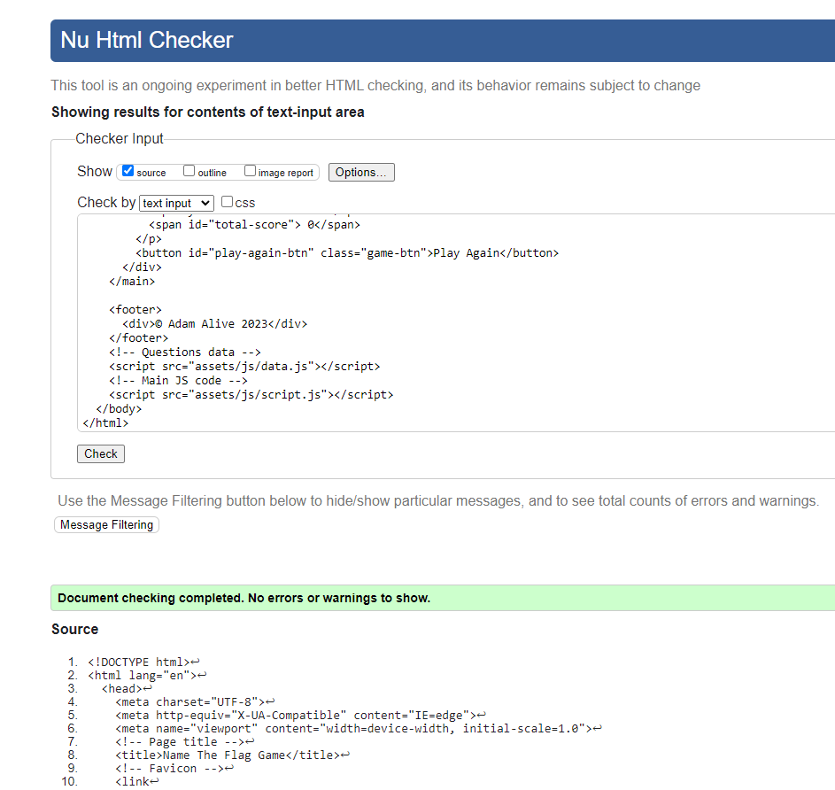

### CSS

I have used the recommended [CSS Jigsaw Validator](https://jigsaw.w3.org/css-validator) to validate my CSS file.

Result:

- Pass: No Errors (one warning about imported fonts).

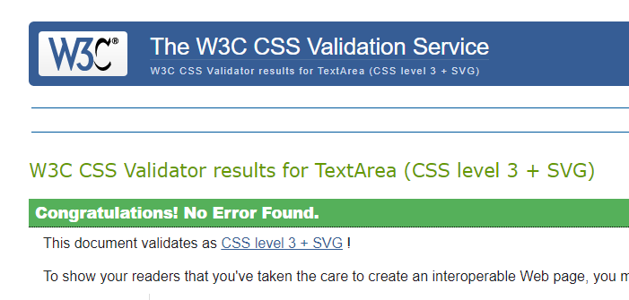

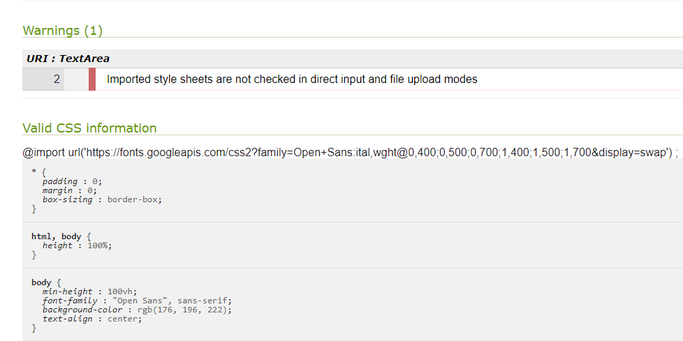

### JavaScript

I have used the recommended [JShint Validator](https://jshint.com) to validate each of my JS files.

Result for script.js:

- Pass: No Errors (note about flagData variable which is the dictionary in data.js).

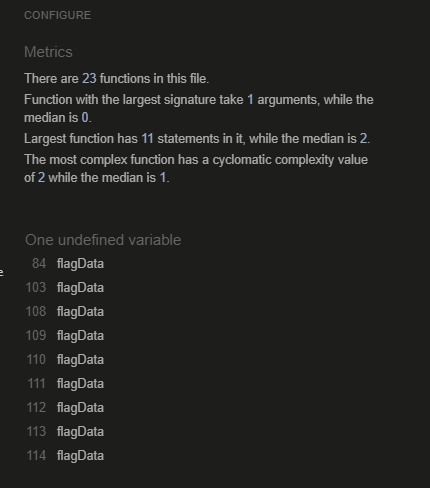

Result for data.js:

- Pass: No Errors (note about flagData variable which is the dictionary).

## Browser Compatibility

I've tested my deployed project on Chrome, Edge and Safari to check for compatibility issues.

I tested each browser on the homepage and at each stage of the game and have provided a summary of these tests below with a screenshot of the homepage or game-play.

| Browser | Home / Game | Notes |
| --- | --- | --- |
| Chrome | 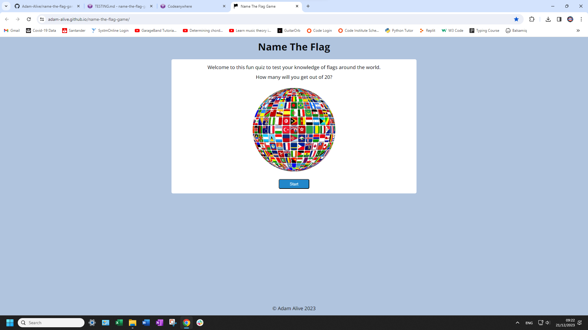 | Works as expected |
| Edge | 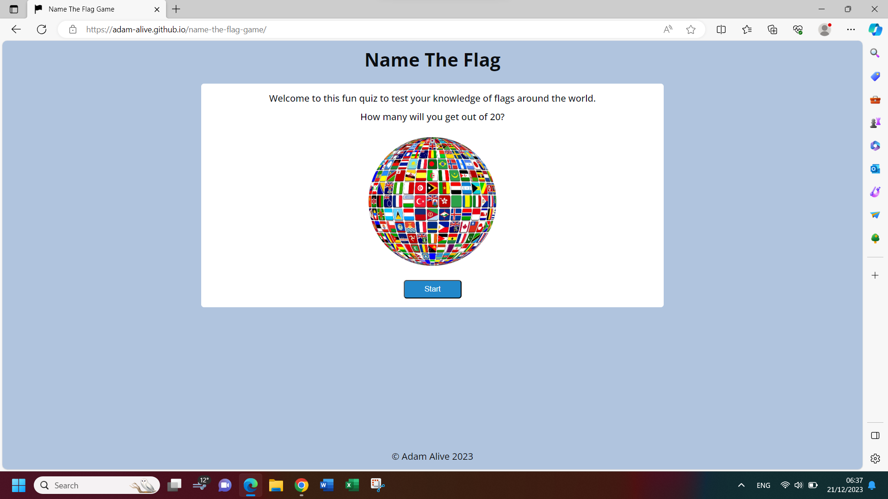 |  Works as expected |
| Safari | 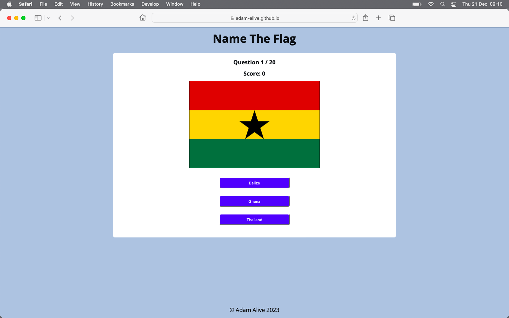 | Works as expected |

## Responsiveness

I deployed the project early on and tested on three of my own devices throughout the development process:

- Moto (g8) power
- HP Desktop (24")
- MacBook Air (13")

I also used Dev Tools to test on a tablet device.

I tested the responsiveness of the homepage and each stage of the game and have provided a summary of these tests below with a screenshot of the homepage or game-play.

| Device | Home /Game | Notes |
| --- | --- | --- |
| Moto(g8) mobile (own) | 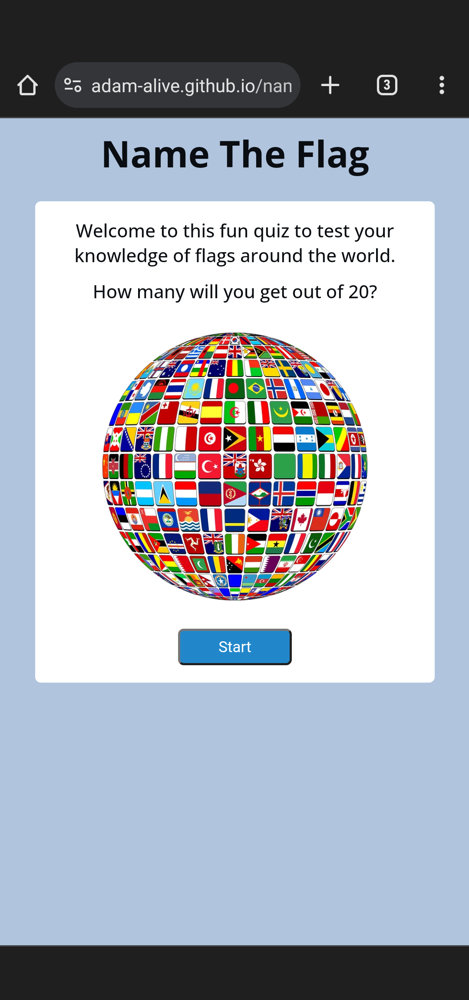 | Works as expected |
| Tablet (DevTools) | 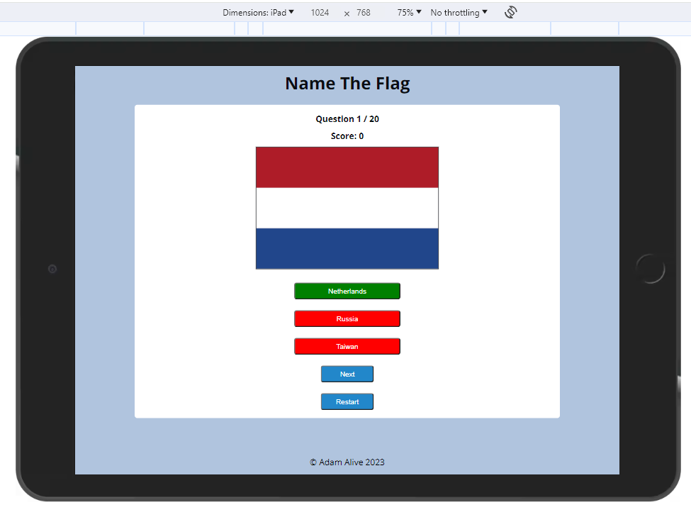 | Works as expected |
| MacBook Air (own) | 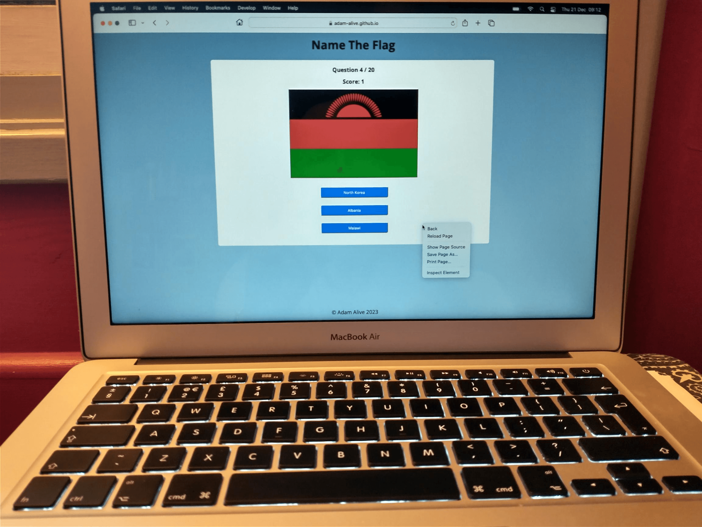 | Works as expected |
| HP Desktop (own) | 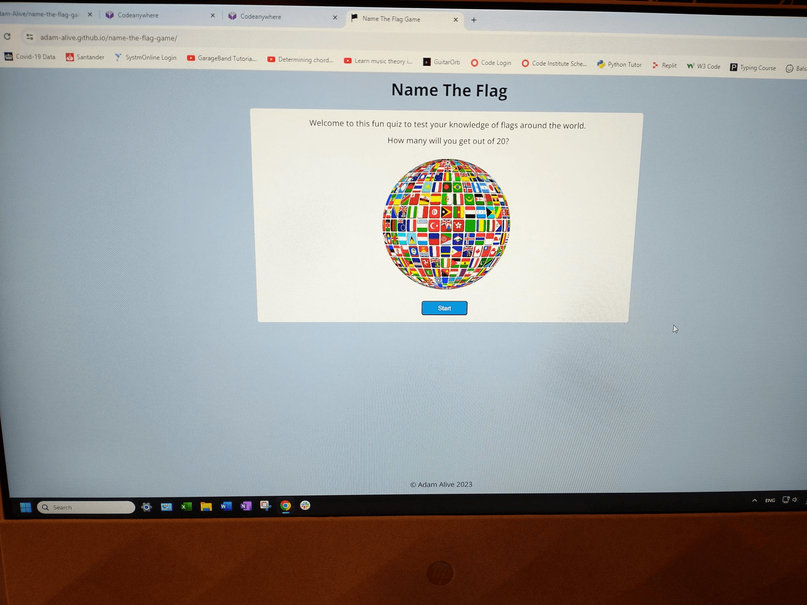 | Works as expected|

## Lighthouse Audit

I've tested my deployed project using the Lighthouse Audit tool to check for any major issues.

Results for mobile devices are 91% and above.

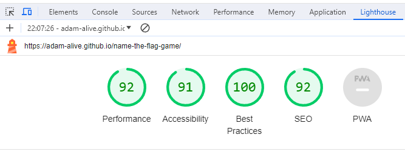

Reesults for desktop devices are 90% and above.

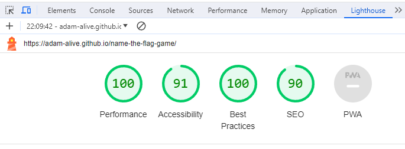

## Defensive Programming

Defensive programming has been manually tested and the Pass/Fail outcomes summarised below.

All stages of the game are played on the homepage with stages hidden / unhidden as the game progresses.

| Page | User Action | Expected Result | Pass/Fail | Comments | Screenshot |
| --- | --- | --- | --- | --- | --- |
| Home | | | | |
| | Hover over Start button | Start button background colour (bgc) will turn light blue to indicate active.| Pass |jjj | jj |
| | Click on Start button | Question 1/20 is displayed with a flag image and 3 answer buttons. | Pass | nn| nn|
| | Hover over any answer button | Answer button bgc will turn light blue to indicate active.| Pass | nn| nn |
| | Hover over any answer button | Answer button bgc will turn light blue to indicate active.| Pass | nn| nn |
| | Hover over any answer button | Answer button bgc will turn light blue to indicate active.| Pass | nn| nn |
| | Hover over any answer button | Answer button bgc will turn light blue to indicate active.| Pass | nn| nn |
| | Hover over any answer button | Answer button bgc will turn light blue to indicate active.| Pass | nn| nn |
| | Hover over any answer button | Answer button bgc will turn light blue to indicate active.| Pass | nn| nn |
| | Hover over any answer button | Answer button bgc will turn light blue to indicate active.| Pass | nn| nn |
| | Hover over any answer button | Answer button bgc will turn light blue to indicate active.| Pass | nn| nn |
| | Hover over any answer button | Answer button bgc will turn light blue to indicate active.| Pass | nn| nn |
| | Hover over any answer button | Answer button bgc will turn light blue to indicate active.| Pass | nn| nn |

🛑🛑🛑🛑🛑 END OF NOTES (to be deleted) 🛑🛑🛑🛑🛑

## Bugs

🛑🛑🛑🛑🛑 START OF NOTES (to be deleted) 🛑🛑🛑🛑🛑

This section is primarily used for JavaScript and Python applications,
but feel free to use this section to document any HTML/CSS bugs you might run into.

It's very important to document any bugs you've discovered while developing the project.
Make sure to include any necessary steps you've implemented to fix the bug(s) as well.

**PRO TIP**: screenshots of bugs are extremely helpful, and go a long way!

🛑🛑🛑🛑🛑 END OF NOTES (to be deleted) 🛑🛑🛑🛑🛑

- JS Uncaught ReferenceError: `foobar` is undefined/not defined

    

  - To fix this, I _____________________.

- JS `'let'` or `'const'` or `'template literal syntax'` or `'arrow function syntax (=>)'` is available in ES6 (use `'esversion: 11'`) or Mozilla JS extensions (use moz).

    

  - To fix this, I _____________________.

- Python `'ModuleNotFoundError'` when trying to import module from imported package

    

  - To fix this, I _____________________.

- Django `TemplateDoesNotExist` at /appname/path appname/template_name.html

    

  - To fix this, I _____________________.

- Python `E501 line too long` (93 > 79 characters)

    

  - To fix this, I _____________________.

## Unfixed Bugs

🛑🛑🛑🛑🛑 START OF NOTES (to be deleted) 🛑🛑🛑🛑🛑

You will need to mention unfixed bugs and why they were not fixed.
This section should include shortcomings of the frameworks or technologies used.
Although time can be a big variable to consider, paucity of time and difficulty understanding
implementation is not a valid reason to leave bugs unfixed.

If you've identified any unfixed bugs, no matter how small, be sure to list them here.
It's better to be honest and list them, because if it's not documented and an assessor finds the issue,
they need to know whether or not you're aware of them as well, and why you've not corrected/fixed them.

Some examples:

🛑🛑🛑🛑🛑 END OF NOTES (to be deleted) 🛑🛑🛑🛑🛑

- On devices smaller than 375px, the page starts to have `overflow-x` scrolling.

    

  - Attempted fix: I tried to add additional media queries to handle this, but things started becoming too small to read.

- For PP3, when using a helper `clear()` function, any text above the height of the terminal does not clear, and remains when you scroll up.

    

  - Attempted fix: I tried to adjust the terminal size, but it only resizes the actual terminal, not the allowable area for text.

- When validating HTML with a semantic `section` element, the validator warns about lacking a header `h2-h6`. This is acceptable.

    

  - Attempted fix: this is a known warning and acceptable, and my section doesn't require a header since it's dynamically added via JS.

🛑🛑🛑🛑🛑 START OF NOTES (to be deleted) 🛑🛑🛑🛑🛑

If you legitimately cannot find any unfixed bugs or warnings, then use the following sentence:

🛑🛑🛑🛑🛑 END OF NOTES (to be deleted) 🛑🛑🛑🛑🛑

There are no remaining bugs that I am aware of.
