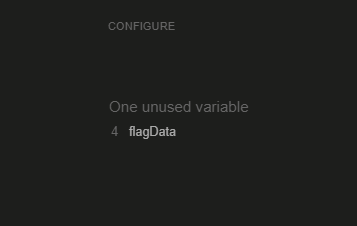
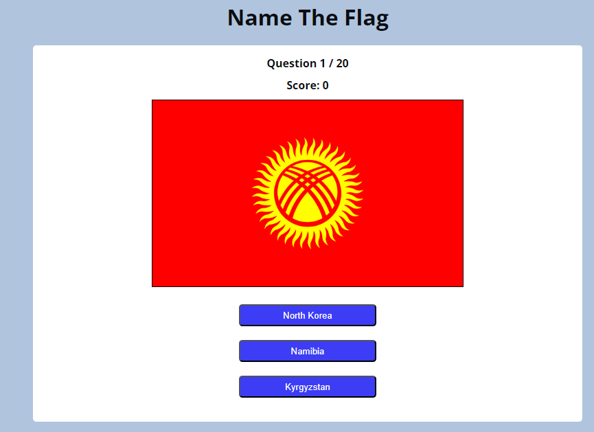

# Testing

Return back to the [README.md](README.md) file.

## Code Validation

### HTML

I have used the recommended [HTML W3C Validator](https://validator.w3.org) to validate my HTML file.

Result:

- Pass: No Errors.

### CSS

I have used the recommended [CSS Jigsaw Validator](https://jigsaw.w3.org/css-validator) to validate my CSS file.

Result:

- Pass: No Errors (one warning about imported fonts).

### JavaScript

I have used the recommended [JShint Validator](https://jshint.com) to validate each of my JS files.

Result for script.js:

- Pass: No Errors (note about flagData variable which is the dictionary in data.js).

Result for data.js:

- Pass: No Errors (note about flagData variable which is the dictionary).

## Browser Compatibility

I've tested my deployed project on Chrome, Edge and Safari to check for compatibility issues.

I tested each browser on the homepage and at each stage of the game and have provided a summary of these tests below with a screenshot of the homepage or game-play.

| Browser | Home / Game | Notes |
| --- | --- | --- |
| Chrome |  | Works as expected |
| Edge |  |  Works as expected |
| Safari |  | Works as expected |

## Responsiveness

I deployed the project early on and tested on three of my own devices throughout the development process:

- Moto (g8) power
- HP Desktop (24")
- MacBook Air (13")

I also used Dev Tools to test on a tablet device.

I tested the responsiveness of the homepage and each stage of the game and have provided a summary of these tests below with a screenshot of the homepage or game-play.

| Device | Home /Game | Notes |
| --- | --- | --- |
| Moto(g8) mobile (own) |  | Works as expected |
| Tablet (DevTools) |  | Works as expected |
| MacBook Air (own) |  | Works as expected |
| HP Desktop (own) |  | Works as expected|

## Lighthouse Audit

I've tested my deployed project using the Lighthouse Audit tool to check for any major issues.

Results for mobile devices are 91% and above.

Results for desktop devices are 90% and above.

## Defensive Programming

Defensive programming has been manually tested and the Pass/Fail outcomes summarised below.

All stages of the game are played on the homepage with stages hidden / unhidden as the game progresses.

| Page | User Action | Expected Result | Pass/Fail | Comments | Screenshot |
| --- | --- | --- | --- | --- | --- |
| Home | | | | |
| | Hover over Start button | Start button background colour (bgc) will turn light blue to indicate active.| Pass |The hover-over function has passed on all buttons ie. answer buttons, Next, Restart and Play Again.|  |
| | Click on Start button | Question 1/20 is displayed with a flag image and 3 answer buttons. | Pass | | |
| | Click on correct answer button | Correct answer button bgc will turn green; other 2 answer buttons will turn red; score will increment by 1; Next and Restart buttons will display.| Pass | | |
| | Click on Next button|Question 2/20 is displayed (and so on) with a new flag image and 3 answer buttons.  | Pass | | |
| | Click on incorrect answer button. |Incorrect answer button bgc will turn red; second incorrect answer button bgc will turn red; correct answer button bgc will turn green; score does not change; Next and Restart buttons will display.| Pass | |  |
| | Click on Restart button | New flag will display with 3 answer buttons; Question 1/20 is displayed; Score 0 is displayed.| Pass | |  |
| |Click on answer button at Question 20/20 | Total Score Message and Score are displayed; Play Again button is displayed| Pass | |  |
| | Click on Play Again button |New flag will display with 3 answer buttons; Question 1/20 is displayed; Score 0 is displayed.| Pass | |  |

## Bugs

- **Issue:** When clicking on Restart or Play Again, a new flag was displayed but the 3 answer buttons were not active when clicked.

  - **Fix:** In JS, regarding the `restartGame()` function, I had not called the `enableButtons()` function. I therefore added this at line 97, see:

    

- **Issue:** When the question for Bosnia and Herzegovina was called, the flag did not display.

    

- **Fix:** Further investigation with Dev Tools indicated that the file name for the webp image was not being converted properly ie. there was a space after `and` within the file name:

    

    I therefore amended the JS code at line 103 from `.replace()` to `.replaceAll()`  in order to capture all spaces in the related country name:

    

    The flag now displays correctly:

    

- **Issue:** When the question for Armenia was called, the flag did not display.

    

  - **Fix:** In the data.js file, which contains the dictionary, I had not included Armenia within the array after `flag:` and this has now been corrected:

    

## Unfixed Bugs

There are no remaining bugs to my knowledge.
